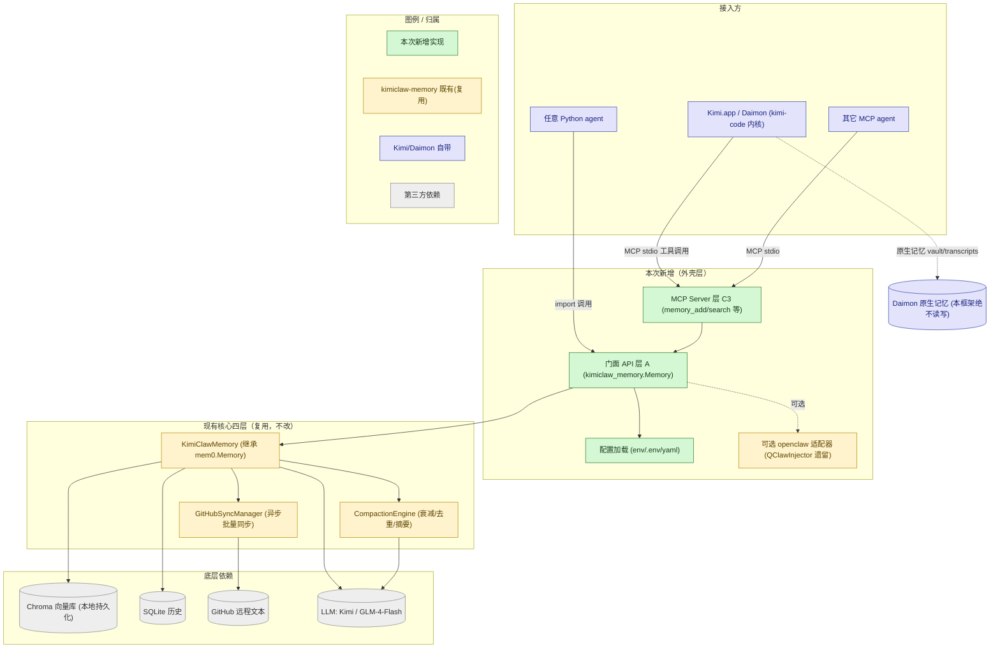
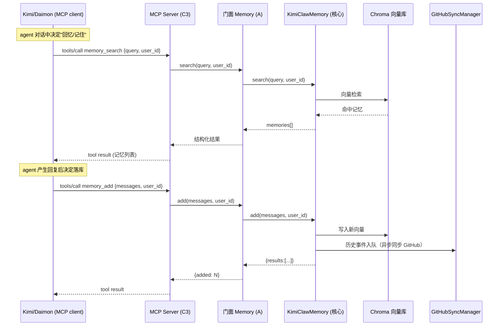
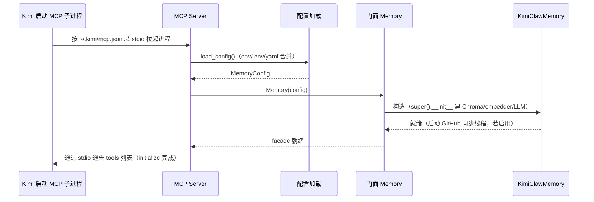

# 设计文档：可嵌入 mem0 记忆框架（embeddable-memory-framework）

## Overview

本功能把现有这套基于 mem0 的记忆系统——`KimiClawMemory`（继承 `mem0.Memory`）+ GitHub 同步层 + Compaction 引擎 + 旧 QClaw 注入器——改造成一个**可复用、易嵌入的记忆框架**，对外提供两个集成面：

- **A. Python 包**：可 `pip install`、对外暴露一个干净的门面类（`from kimiclaw_memory import Memory`），任意 Python agent 一两行即可 `add` / `search` / `get_all` / `delete` / `compact`。
- **C3. MCP server（主集成方式）**：把记忆能力暴露成 MCP 工具（`memory_add` / `memory_search` / ...），供支持 MCP 的 agent（首要目标是 **Kimi.app / Daimon 运行时**，也通用于任何 MCP 客户端）在对话中调用。

**核心设计约束（均经本机实测确认，不是假设）**：

1. **真实集成目标是 Kimi.app（Daimon 运行时，`kimi-code` 内核），不是 openclaw。** 实测 `daimon/config.json` 中 `agentKernel=kimi-code`、`openClawCompatibility=disabled`；provision 日志 `--skip-openclaw` / `OpenClaw compat: skipped`；`openclaw-shim/` 为空。`~/.qclaw` 是用户已删除的旧 openclaw 残留。
2. **Daimon 已自带原生记忆系统**（`transcripts/` 原始流水 + `vault/`：`about_user.md`/`sections/`/`entities/`/`index.md`；features 含 `memory.inject.promptContext` / `memory.extract.shortTerm` / `memory.dream`）。
3. **用户决策：本框架与 Daimon 原生记忆「共存」，作为一个额外的长期记忆源通过 MCP 被调用，绝不直接读写 Daimon 的 vault/transcripts**（会与它的 extractor/dream 冲突）。
4. **不重构现有核心四层**（用户明确：没必要就不动），全部复用。
5. **旧 `QClawInjector` 降级为可选 / 遗留适配器**，仅在用户另跑真正的 openclaw agent（写 USER.md/SOUL.md）时启用，非主路径。

因此本设计的核心问题是：**在不改动现有四层、不侵入 Daimon 的前提下，叠加「门面 API 层」与「MCP server 层」两个新外壳，并补齐标准打包与配置加载，让这套记忆能力既能被 Python 直接 import，又能作为独立 MCP 进程被 Kimi/Daimon 调用。**

## Architecture



> **图例说明**：绿色=本次功能新增实现（MCP server / 门面 / 配置加载 / 打包）；黄色=`kimiclaw-memory` 项目**既有、本次直接复用不改**的核心层；蓝色=**Kimi/Daimon 自带**能力（其原生记忆本框架绝不读写）；灰色=第三方依赖。

**关键架构决策：**

1. **两层新外壳、零核心改动。** 门面层（A）和 MCP 层（C3）都只是对现有 `KimiClawMemory` 的封装。`KimiClawMemory`、`GitHubSyncManager`、`CompactionEngine` 原样复用。

2. **MCP 层建在门面层之上，而非直接调核心。** MCP 工具的实现统一委派给门面 API，保证两个集成面行为一致、只维护一套业务逻辑。

3. **与 Daimon 完全解耦、进程隔离。** MCP server 是独立进程，自己维护 mem0 向量库（Chroma）+ 本地 SQLite + 可选 GitHub 同步。**它不感知、不读写 Daimon 的 vault/transcripts**，仅通过 MCP 工具被 Daimon 调用。两套记忆按 `user_id` 维度各自独立。

4. **`QClawInjector` 标注为 optional/legacy。** 门面层提供一个可选开关 `enable_openclaw_inject`，默认关闭；只有用户明确接入 openclaw 文件工作区时才注入 USER.md/SOUL.md。它不在 MCP 主路径上。

5. **配置三级合并**：默认值 < yaml 文件（可选）< 环境变量 / `.env`。密钥（`KIMI_API_KEY` / `ZHIPU_API_KEY` / `GITHUB_TOKEN`）只从 env 读取，绝不写入配置文件或记忆库。

## 时序图

### 主流程：Kimi/Daimon 通过 MCP 调用记忆



### 启动流程：MCP server 冷启动



## Components and Interfaces

### 组件 1：门面 API 层（A）—— `kimiclaw_memory.Memory`

**目的**：对外唯一稳定入口，封装配置加载、`KimiClawMemory` 生命周期、以及"add→可选 compact"等组合操作，屏蔽底层细节。

**接口**：

```python
# kimiclaw_memory/facade.py
from dataclasses import dataclass
from typing import Any, Optional

class Memory:
    """可嵌入记忆框架的统一门面。

    用法：
        from kimiclaw_memory import Memory
        mem = Memory.from_env()                 # 从环境变量/.env 构造
        mem.add(messages, user_id="u1")
        hits = mem.search("用户喜欢什么", user_id="u1")
    """

    def __init__(self, config: "MemoryConfig") -> None: ...

    @classmethod
    def from_env(cls, yaml_path: Optional[str] = None) -> "Memory":
        """从环境变量 / .env / 可选 yaml 合并出配置并构造。"""

    def add(self, messages, *, user_id: str,
            agent_id: Optional[str] = None,
            run_id: Optional[str] = None,
            auto_inject: bool = False) -> dict:
        """新增记忆。auto_inject=True 且启用了 openclaw 适配器时，
        额外把结果注入 USER.md/SOUL.md（遗留路径，默认关闭）。"""

    def search(self, query: str, *, user_id: str,
               limit: int = 5) -> list[dict]: ...

    def get_all(self, *, user_id: str, limit: int = 100) -> list[dict]: ...

    def delete(self, memory_id: str, *, user_id: str) -> dict: ...

    def compact(self, *, user_id: Optional[str] = None,
                dry_run: bool = False) -> dict: ...

    def close(self) -> None:
        """优雅关闭：停止 GitHub 同步线程、关闭 DB。"""

    def __enter__(self) -> "Memory": ...
    def __exit__(self, *exc) -> None: ...   # 自动 close()
```

**职责**：
- 统一封装核心 `KimiClawMemory` 的 add/search/compact/close。
- 提供 `get_all` / `delete`（直接代理到 `mem0.Memory` 的同名能力）。
- 持有配置；管理生命周期（上下文管理器自动关闭）。
- 可选触发遗留 openclaw 注入。

### 组件 2：MCP server 层（C3）—— `kimiclaw_memory.mcp_server`

**目的**：把门面 API 暴露成 MCP 工具，让 Kimi/Daimon 等 MCP 客户端通过 stdio 调用。

**接口**（采用 Python 官方 MCP SDK 的 `FastMCP`）：

```python
# kimiclaw_memory/mcp_server.py
from mcp.server.fastmcp import FastMCP

app = FastMCP("kimiclaw-memory")

@app.tool()
def memory_add(messages: str, user_id: str) -> dict:
    """把一段对话/事实写入长期记忆。messages 为纯文本或 JSON 消息数组。"""

@app.tool()
def memory_search(query: str, user_id: str, limit: int = 5) -> list[dict]:
    """按语义检索某用户的长期记忆，返回最相关的若干条。"""

@app.tool()
def memory_get_all(user_id: str, limit: int = 100) -> list[dict]:
    """列出某用户的全部记忆（分页上限 limit）。"""

@app.tool()
def memory_delete(memory_id: str, user_id: str) -> dict:
    """按记忆 id 删除一条记忆。"""

@app.tool()
def memory_compact(user_id: str | None = None, dry_run: bool = False) -> dict:
    """触发压缩（时间衰减归档 + 去重合并 + 滚动摘要）。"""

def main() -> None:
    """控制台入口：构造门面（Memory.from_env）并以 stdio 运行 MCP server。"""
    app.run(transport="stdio")
```

**职责**：
- 进程启动时通过 `Memory.from_env()` 构造一个进程级单例门面。
- 每个 tool 把参数转发给门面对应方法，把返回值序列化为 MCP 工具结果。
- 仅 stdio 传输（本地、随 Kimi 子进程生命周期）。
- 进程退出时调用 `memory.close()`。

### 组件 3：配置加载 —— `kimiclaw_memory.config`

**目的**：把分散的 env / `.env` / 可选 yaml 合并为一个 `MemoryConfig`，并组装成核心 `KimiClawMemory` 所需的 dict（mem0 原生配置 + 自定义 `github_sync`/`compaction`/`qclaw` 段）。

**接口**：

```python
# kimiclaw_memory/config.py
@dataclass
class MemoryConfig:
    # LLM
    llm_provider: str = "openai"          # OpenAI 兼容
    llm_api_key: str = ""                 # 来自 KIMI_API_KEY / ZHIPU_API_KEY
    llm_base_url: str = ""                # KIMI_BASE_URL / ZHIPU_BASE_URL
    llm_model: str = "moonshot-v1-8k"     # KIMI_MODEL / glm-4-flash
    # 向量库
    vector_store_path: str = "~/.kimiclaw_memory/chroma"
    # GitHub 同步（可选）
    github_enabled: bool = False
    github_repo: str = ""
    github_token: str = ""                # 来自 GITHUB_TOKEN
    # Compaction（可选）
    compaction_enabled: bool = True
    half_life_days: float = 90.0
    dedup_threshold: float = 0.92
    # openclaw 遗留注入（可选，默认关）
    enable_openclaw_inject: bool = False
    qclaw_workspace_dir: str = ""

def load_config(yaml_path: Optional[str] = None) -> MemoryConfig:
    """默认值 < yaml < 环境变量/.env 三级合并。"""

def to_core_dict(cfg: MemoryConfig) -> dict:
    """转换为 KimiClawMemory(config) 所需的 dict（含 github_sync/compaction/qclaw 段）。"""
```

### 组件 4：核心四层（复用，不改动）

| 层 | 类 / 模块 | 复用的对外方法 |
|----|-----------|----------------|
| 核心入口 | `KimiClawMemory(mem0.Memory)` | `add(messages,*,user_id,...)` / `search(query,user_id,...)` / `compact(user_id,dry_run)` / `close()`，外加 mem0 原生 `get_all` / `delete` |
| GitHub 同步 | `GitHubSyncManager` | `start/stop/queue_event/_flush/pull_memories/pull_history/pull_profile` |
| Compaction | `CompactionEngine` | `compact(user_id,dry_run)`（三策略：时间衰减/去重/滚动摘要） |
| openclaw 注入（遗留） | `QClawInjector` | `inject_memories(memories,user_id)` / `update_soul(...)`（仅可选路径） |

## Data Models

### 模型 1：MemoryRecord（贯穿门面与 MCP）

```python
MemoryRecord = TypedDict("MemoryRecord", {
    "id": str,
    "data": str,                 # 记忆文本
    "category": str,             # personal | preference | professional | plan | activity | health | misc
    "score": float,             # search 时的相关度（get_all 时可缺省）
    "metadata": dict,            # 可能含 decay_score / merged_from（compaction 产生）
    "updated_at": str,          # ISO 8601
})
```

**校验规则**：
- `metadata` **不得**包含 `importance` / `entity` / `confidence`（用户明确拒绝）。
- `user_id` 在所有公开方法中必填且非空。

### 模型 2：MCP 工具结果包装

```python
# 成功
{"ok": True, "data": <list|dict>}
# 失败（不抛裸异常给客户端，统一包装）
{"ok": False, "error": "<message>", "code": "<CONFIG|NOT_FOUND|BACKEND|...>"}
```

## MCP 工具的 JSON inputSchema

```jsonc
// memory_add
{
  "type": "object",
  "properties": {
    "messages": {"type": "string", "description": "纯文本或 JSON 消息数组字符串"},
    "user_id":  {"type": "string"}
  },
  "required": ["messages", "user_id"]
}
// memory_search
{
  "type": "object",
  "properties": {
    "query":   {"type": "string"},
    "user_id": {"type": "string"},
    "limit":   {"type": "integer", "default": 5, "minimum": 1, "maximum": 50}
  },
  "required": ["query", "user_id"]
}
// memory_get_all
{
  "type": "object",
  "properties": {
    "user_id": {"type": "string"},
    "limit":   {"type": "integer", "default": 100}
  },
  "required": ["user_id"]
}
// memory_delete
{
  "type": "object",
  "properties": {
    "memory_id": {"type": "string"},
    "user_id":   {"type": "string"}
  },
  "required": ["memory_id", "user_id"]
}
// memory_compact
{
  "type": "object",
  "properties": {
    "user_id":  {"type": ["string", "null"], "default": null},
    "dry_run":  {"type": "boolean", "default": false}
  }
}
```

## 在 Kimi 中注册 MCP server（`~/.kimi/mcp.json` 示例）

```jsonc
{
  "mcpServers": {
    "kimiclaw-memory": {
      "command": "uvx",
      "args": ["--from", "kimiclaw-memory", "kimiclaw-memory-mcp"],
      "env": {
        "KIMI_API_KEY": "sk-xxxx",
        "KIMI_BASE_URL": "https://api.moonshot.cn/v1",
        "KIMI_MODEL": "moonshot-v1-8k",
        "GITHUB_TOKEN": ""
      }
    }
  }
}
```

> 说明：`kimiclaw-memory-mcp` 是包在 `pyproject.toml` 中注册的 console-script 入口（见下）。也可用本地 venv 的绝对路径 `command` 指向 `python -m kimiclaw_memory.mcp_server`。

## 打包（pyproject.toml 关键片段）

```toml
[project]
name = "kimiclaw-memory"
version = "0.1.0"
requires-python = ">=3.10"
dependencies = [
  "mem0ai>=0.1",
  "chromadb",
  "openai",
  "numpy",
  "requests",
  "python-dotenv",
  "mcp>=1.0",          # MCP server 层（FastMCP）
]

[project.scripts]
kimiclaw-memory-mcp = "kimiclaw_memory.mcp_server:main"

[build-system]
requires = ["hatchling"]
build-backend = "hatchling.build"

[tool.hatch.build.targets.wheel]
packages = ["src/kimiclaw_memory"]
```

> 打包附带的目录调整：现有 `src/memory/*` 迁移/重导出为可被 `kimiclaw_memory` 包导入的模块（保持类不变，仅补 `__init__.py` 导出与包名空间），消除现有 `sys.path.insert` 依赖。这是**新增打包外壳**，非核心重构。

## 算法伪代码

### 门面 add（含可选注入）

```python
def add(self, messages, *, user_id, agent_id=None, run_id=None, auto_inject=False):
    assert user_id, "user_id 必填"
    result = self._core.add(messages, user_id=user_id,
                            agent_id=agent_id, run_id=run_id)   # 复用核心
    if auto_inject and self._injector is not None:             # 遗留 openclaw 路径
        self._injector.inject_memories(result.get("results", []), user_id=user_id)
    return {"added": len(result.get("results", [])),
            "results": _strip_forbidden_metadata(result.get("results", []))}
```

**前置条件**：`user_id` 非空；门面已构造。
**后置条件**：返回值不含被禁止的 metadata 键；若启用同步，历史事件已入队。

### MCP 工具分发（统一错误包装）

```python
def _dispatch(fn, **kwargs):
    try:
        return {"ok": True, "data": fn(**kwargs)}
    except ConfigError as e:
        return {"ok": False, "error": str(e), "code": "CONFIG"}
    except KeyError:
        return {"ok": False, "error": "memory not found", "code": "NOT_FOUND"}
    except Exception as e:                       # 兜底，不把栈泄露给客户端
        logger.exception("mcp tool failed")
        return {"ok": False, "error": str(e), "code": "BACKEND"}
```

### 配置三级合并

```python
def load_config(yaml_path=None):
    cfg = MemoryConfig()                         # 1. 默认值
    if yaml_path and exists(yaml_path):
        cfg = merge(cfg, read_yaml(yaml_path))   # 2. yaml 覆盖
    load_dotenv()                                # 读 .env 到 env
    cfg.llm_api_key = env("KIMI_API_KEY") or env("ZHIPU_API_KEY") or cfg.llm_api_key
    cfg.llm_base_url = env("KIMI_BASE_URL") or env("ZHIPU_BASE_URL") or cfg.llm_base_url
    cfg.github_token = env("GITHUB_TOKEN") or cfg.github_token
    cfg.github_enabled = bool(cfg.github_repo and cfg.github_token)
    # 3. 环境变量优先级最高
    return cfg
```

## 与 Daimon 共存的边界（关键安全约束）

- MCP server 是**独立进程**，数据目录默认 `~/.kimiclaw_memory/`（Chroma + SQLite），与 Daimon 的 `~/Library/Application Support/kimi-desktop/.../daimon/` **完全分离**。
- 本框架**绝不**读取或写入 Daimon 的 `vault/`、`transcripts/`、`sections/`、`entities/`。
- Daimon 的原生记忆（extract/dream/inject）照常运行；本框架只是 agent 可主动调用的**额外长期记忆库**。
- 是否落库由 agent（Daimon 侧）决定何时调用 `memory_add` / `memory_search`，框架不主动 hook Daimon 内部流程。

## Correctness Properties

以下命题定义"框架正确工作"的含义，驱动测试设计。

### Property 1: 两个集成面行为一致
对同一组输入，经 MCP 工具调用与经门面 API 直接调用，产生相同的记忆库状态与等价的返回数据。
**Validates: Requirements 1.1, 2.3, 5.2**

### Property 2: 被禁止 metadata 永不外泄
∀ 经门面或 MCP 返回 / 同步到 GitHub 的记忆，`metadata` 不含 `importance` / `entity` / `confidence`。
**Validates: Requirements 1.5**

### Property 3: Daimon 数据零触碰
框架的任何操作都不读取、不写入 Daimon 的数据目录（`kimi-desktop/.../daimon/`）；本框架数据仅落在自身数据目录。

### Property 4: user_id 隔离
∀ 两个不同 `user_id` 的记忆互不可见：`search(q, user_id=A)` 绝不返回 `user_id=B` 的记忆。

### Property 5: 密钥不落盘到记忆
∀ 持久化产物（Chroma、SQLite、GitHub 同步文件），其中不含 LLM/GitHub 密钥明文。

### Property 6: MCP 错误统一包装
∀ 工具内部异常，返回 `{"ok": false, "error":..., "code":...}`，绝不向客户端抛裸异常或泄露堆栈。

### Property 7: 优雅关闭
进程退出后，GitHub 同步后台线程不再存活，待处理队列已 flush。

## Error Handling

| 场景 | 条件 | 响应 |
|------|------|------|
| 缺少 LLM 密钥 | env 中 `KIMI_API_KEY`/`ZHIPU_API_KEY` 均空 | `load_config` 抛 `ConfigError`；MCP 启动时以清晰日志失败，`memory_*` 返回 `code=CONFIG` |
| mem0/chromadb 未安装 | import 失败 | 启动期失败并提示在 uv 3.11 venv 安装依赖 |
| GitHub 同步未启用 | 无 repo/token | `github_enabled=False`，纯本地运行，不报错 |
| MCP 工具内部异常 | 任意后端错误 | `_dispatch` 统一包装为 `{ok:false,...}`，不泄露堆栈 |
| 缺 `user_id` | 公开方法未传 | 抛 `ValueError`（门面）/ 返回 `code=BACKEND`（MCP） |
| 进程被 Kimi 终止 | stdio 关闭 | 注册退出钩子调用 `memory.close()`，停同步线程 |

## Testing Strategy

### 单元测试
- 现有四层已有单测（`test_github_sync.py`、`test_compaction.py`、`test_injector.py`）继续保留。
- 新增：`config` 三级合并、门面 `add/search/get_all/delete` 代理正确、被禁止 metadata 被剥离、上下文管理器自动 close。

### MCP 层测试
- 用 MCP 客户端测试夹具（in-memory transport 或子进程 stdio）调用每个 tool，断言：参数 schema 校验、成功/失败包装、`memory_search` 命中、`memory_add` 落库、错误统一包装。

### 集成测试（纳入既有「端到端集成测试」设计）
- 复用此前为 `end-to-end-integration-test` 设计的流水线测试：**真实内层 + 伪造外部边界**（LLM/Chroma/GitHub mock），跑 search → LLM → add →（可选注入）→ compact，断言跨层数据流。
- 在其基础上追加**经 MCP 入口**驱动同一流水线的端到端用例（MCP client → tools → 门面 → 核心），验证两个集成面行为一致。

## 性能考量

- MCP server 为常驻进程，门面单例复用，避免每次工具调用重建 mem0/Chroma。
- `memory_search` 默认 `limit=5`，控制返回体积与 LLM 上下文占用。
- GitHub 同步异步批量（沿用现有 `_flush` 机制），不阻塞工具响应。

## 安全考量

- 密钥仅经 env / `.env` 注入，**绝不**写入 Chroma、SQLite 或同步到 GitHub。
- MCP 仅 stdio 本地传输，不开网络端口，随 Kimi 子进程生命周期。
- 多 agent / 多用户按 `user_id` 隔离记忆。
- 不触碰 Daimon 私有数据目录，避免越权读取用户其它记忆。

## 依赖

- **运行时**：`mem0ai`(≥3.10)、`chromadb`、`openai`、`numpy`、`requests`、`python-dotenv`、`mcp`（MCP server 层）。
- **环境**：`uv venv --python 3.11 && uv pip install -e .`。
- **环境变量**：`KIMI_API_KEY` / `KIMI_BASE_URL` / `KIMI_MODEL`（兜底 `ZHIPU_API_KEY` + GLM-4-Flash）、可选 `GITHUB_TOKEN`。
- **内部复用**：`KimiClawMemory`、`GitHubSyncManager`、`CompactionEngine`、`QClawInjector`（遗留）。
