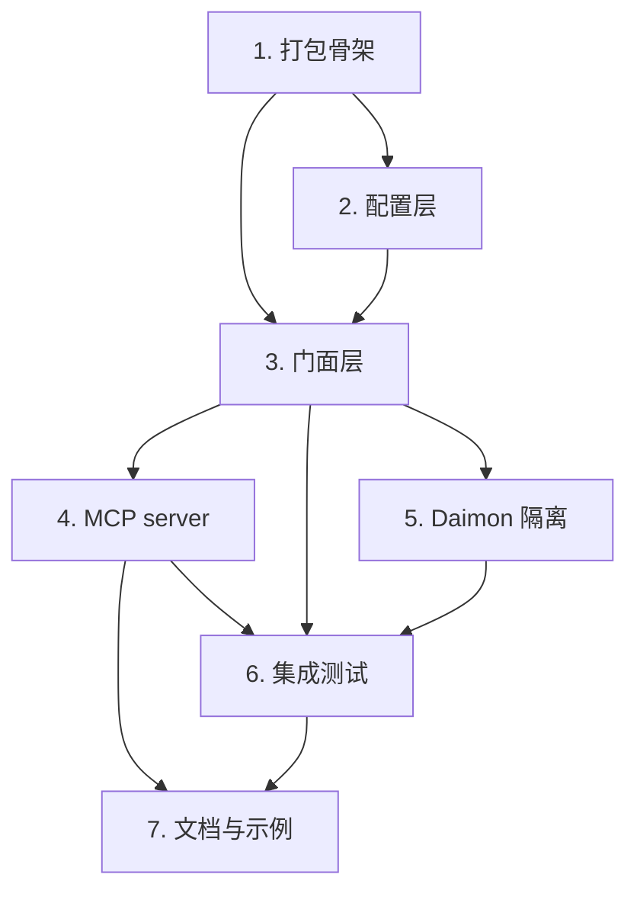

# Implementation Plan

## Overview

本计划在不改动既有核心四层的前提下，叠加打包骨架、配置层、门面 API、MCP server 三层外壳，并补齐隔离保障、集成测试与文档。带 `*` 的子任务为属性测试（可选但推荐），对应设计中的正确性属性。

## Tasks

- [x] 1. 建立包结构与打包骨架
  - 创建 `pyproject.toml`（包名 `kimiclaw-memory`、import 名 `kimiclaw_memory`、`requires-python>=3.10`、hatchling 构建、运行时依赖 mem0ai/chromadb/openai/numpy/requests/python-dotenv/mcp）
  - 注册 console-script `kimiclaw-memory-mcp = "kimiclaw_memory.mcp_server:main"`
  - 建立 `src/kimiclaw_memory/` 包目录与 `__init__.py`，把既有 `src/memory/*` 通过包内重导出纳入命名空间（不改动既有类），消除 `sys.path.insert` 依赖
  - 用 `uv venv --python 3.11 && uv pip install -e .` 验证可编辑安装，确认 `from kimiclaw_memory import Memory` 可导入
  - _Requirements: 4.1, 4.2, 4.3, 5.1_

- [x] 2. 实现配置加载层 `kimiclaw_memory/config.py`
  - [x] 2.1 定义 `MemoryConfig` dataclass 与 `ConfigError` 异常
    - 字段覆盖 LLM（provider/api_key/base_url/model）、向量库路径、GitHub（enabled/repo/token）、Compaction（enabled/half_life/dedup_threshold）、openclaw 开关（enable_openclaw_inject/qclaw_workspace_dir）
    - _Requirements: 3.1_
  - [x] 2.2 实现 `load_config(yaml_path)` 三级合并（默认 < yaml < env/.env）
    - 用 python-dotenv 读 `.env`；从 `KIMI_API_KEY`（兜底 `ZHIPU_API_KEY`）、`KIMI_BASE_URL`/`ZHIPU_BASE_URL`、`KIMI_MODEL`、`GITHUB_TOKEN` 读取
    - 同时配齐 repo+token 时 `github_enabled=True`，否则纯本地不报错；LLM 密钥全缺失时抛 `ConfigError`
    - _Requirements: 3.1, 3.2, 3.3, 3.4_
  - [x] 2.3 实现 `to_core_dict(cfg)` 组装 `KimiClawMemory` 所需 dict（mem0 原生 + `github_sync`/`compaction`/`qclaw` 段）
    - 确保密钥不写入任何持久化产物（仅运行时内存传递）
    - _Requirements: 3.5_
  - [x] 2.4 编写配置层单元测试（三级合并优先级、密钥缺失抛错、github 启用判定）
    - _Requirements: 3.1, 3.2, 3.3, 3.4_

- [x] 3. 实现门面 API 层 `kimiclaw_memory/facade.py`
  - [x] 3.1 实现 `Memory` 类与 `from_env` 构造、生命周期
    - `__init__(config)`、`@classmethod from_env(yaml_path=None)`、`__enter__`/`__exit__`（退出调用 `close`）
    - 内部持有既有 `KimiClawMemory`，可选构造 `QClawInjector`（仅当 `enable_openclaw_inject`）
    - _Requirements: 1.1, 1.2, 1.4, 9.2_
  - [x] 3.2 实现 `add` / `search` / `get_all` / `delete` / `compact` / `close`
    - 全部强校验非空 `user_id`，缺失抛 `ValueError`
    - `add(auto_inject=False)`：默认不写 openclaw 文件；为 true 且启用注入器时才调用 `inject_memories`
    - 返回前剥离被禁止 metadata（importance/entity/confidence）
    - `compact(dry_run)` 委派 `CompactionEngine`；`close` 停同步线程并 flush
    - _Requirements: 1.1, 1.3, 1.5, 7.1, 7.2, 7.3, 8.1, 8.2, 9.3_
  - [x] 3.3 编写门面单元测试
    - add/search/get_all/delete 代理正确；缺 user_id 抛错；禁止 metadata 被剥离；上下文管理器自动 close；`enable_openclaw_inject=false` 时不写文件
    - _Requirements: 1.3, 1.5, 8.1, 9.3_
  - [x]* 3.4 编写属性测试：被禁止 metadata 永不外泄、user_id 隔离
    - 生成随机记忆与多 user 场景，断言返回/同步产物不含禁止字段，且跨 user 检索零泄露
    - _Requirements: 1.5, 6.3 (Design Property 2, 4)_

- [x] 4. 实现 MCP server 层 `kimiclaw_memory/mcp_server.py`
  - [x] 4.1 用 FastMCP 搭建 server 与进程级单例门面
    - 启动时 `Memory.from_env()` 构造单例；注册退出钩子调用 `memory.close()`
    - `main()` 以 `transport="stdio"` 运行
    - _Requirements: 2.2, 2.3, 2.6_
  - [x] 4.2 实现 5 个工具与统一分发包装
    - `memory_add`/`memory_search`/`memory_get_all`/`memory_delete`/`memory_compact`，参数与设计中的 inputSchema 一致
    - `_dispatch` 统一包装：成功 `{ok:true,data}`，异常 `{ok:false,error,code}`（CONFIG/NOT_FOUND/BACKEND），不泄露堆栈
    - _Requirements: 2.1, 2.4, 2.5_
  - [x] 4.3 编写 MCP 层测试（子进程 stdio 或 in-memory transport 夹具）
    - 每个工具的成功/失败包装、schema 校验、memory_search 命中、memory_add 落库、异常被包装为 code
    - _Requirements: 2.1, 2.4, 2.5_
  - [x]* 4.4 编写属性测试：MCP 错误统一包装
    - 注入随机失败，断言始终返回 `{ok:false,...}` 且无堆栈泄露
    - _Requirements: 2.4 (Design Property 6)_

- [x] 5. 与 Daimon 共存隔离的保障
  - [x] 5.1 默认数据目录隔离与边界守卫
    - Chroma/SQLite 默认落 `~/.kimiclaw_memory/`；新增断言/守卫，确保代码路径不触及 Daimon 数据目录
    - _Requirements: 6.1, 6.2, 6.4_
  - [x]* 5.2 编写属性/集成测试：Daimon 数据零触碰
    - 在临时 HOME 下运行全流程，断言 Daimon 目录无任何读写（监控文件访问或路径前缀校验）
    - _Requirements: 6.1, 6.4 (Design Property 3)_

- [x] 6. 集成测试（纳入既有「端到端集成测试」设计）
  - [x] 6.1 搭建测试替身与流水线构建器
    - FakeEmbedder/FakeLLM/CapturingGitHub + build_pipeline（真实内层 + 伪造外部边界），沿用 e2e 设计
    - _Requirements: 5.3_
  - [x] 6.2 经门面驱动的端到端用例：search → LLM → add →（可选注入）→ compact
    - 断言跨层数据流、压缩报告、被禁止 metadata 缺失、优雅关闭
    - _Requirements: 5.3, 7.1, 8.2_
  - [x] 6.3 经 MCP 入口驱动同一流水线，校验两个集成面行为一致
    - _Requirements: 2.3, 5.2 (Design Property 1)_
  - [x] 6.4 回归既有单测（test_github_sync/test_compaction/test_injector）全部通过
    - _Requirements: 5.3_

- [x] 7. 文档与接入示例
  - 编写 README：安装（uv 3.11）、`Memory.from_env` 用法、`~/.kimi/mcp.json` 注册 MCP 示例、openclaw/QClaw 经 MCP 接入说明
  - 提供 `.env.example` 增补（确认 KIMI/ZHIPU/GITHUB_TOKEN 变量）
  - _Requirements: 2.2, 4.3, 9.1_

## Task Dependency Graph

```json
{
  "waves": [
    { "wave": 1, "tasks": ["1"], "rationale": "打包骨架，所有后续任务的前提" },
    { "wave": 2, "tasks": ["2"], "rationale": "配置层，门面依赖它" },
    { "wave": 3, "tasks": ["3"], "rationale": "门面层，依赖打包与配置" },
    { "wave": 4, "tasks": ["4", "5"], "rationale": "MCP server 与 Daimon 隔离保障，均依赖门面，可并行" },
    { "wave": 5, "tasks": ["6"], "rationale": "集成测试，依赖门面/MCP/隔离" },
    { "wave": 6, "tasks": ["7"], "rationale": "文档与接入示例，依赖 MCP 与集成验证" }
  ]
}
```



## Notes

- 执行顺序：1 → 2 → 3 → (4, 5 可并行) → 6 → 7。
- 带 `*` 的子任务为属性测试（可选但推荐），对应设计中的正确性属性 Property 1~7。
- 环境前提：系统 Python 3.9 不满足 mem0ai，需 `uv venv --python 3.11` 并 `uv pip install -e .`。
- 既有核心四层（KimiClawMemory/GitHubSyncManager/CompactionEngine/QClawInjector）只复用不改，既有单测须保持通过。
