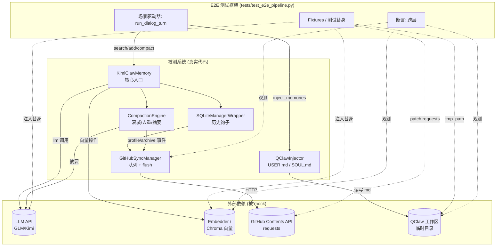
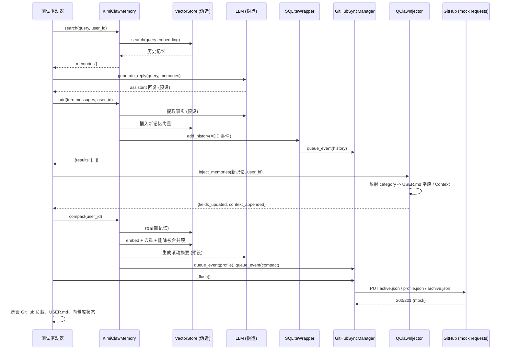
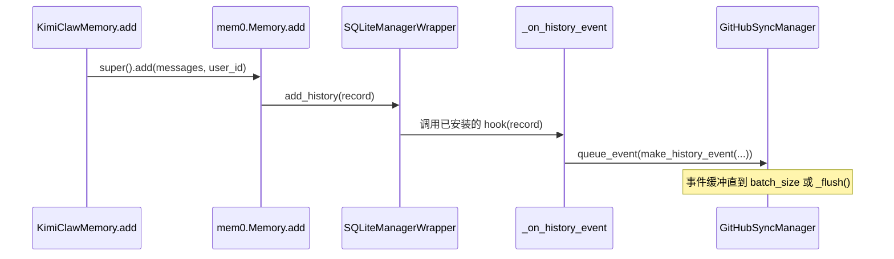

# 设计文档：端到端集成测试（end-to-end-integration-test）

## 概述

本功能交付一套**端到端（E2E）集成测试**，把 KimiClaw-Memory 已完成的四个层——GitHub 同步层（`GitHubSyncManager`）、Compaction 引擎（`CompactionEngine`）、QClaw 注入层（`QClawInjector`）以及核心入口（`KimiClawMemory`）——串联成一条真实的对话流水线，并断言它们能正确协同工作。

这条流水线模拟一个真实的对话回合：用户提出问题，系统**检索（search）**历史记忆，**LLM** 产生回复，系统从该回合**新增（add）**提取出的记忆（继而扇出到 SQLite 历史 → GitHub 同步队列），把得到的记忆**注入（inject）**到 QClaw 的 `USER.md`/`SOUL.md`，最后对累积的记忆库执行**压缩（compact）**（时间衰减 → 去重 → 滚动摘要 → GitHub `profile.json`/`archive.json`）。

由于真实系统依赖三个在测试中绝不能真正访问的外部服务——LLM API（GLM/Kimi）、GitHub Contents API、Chroma embedding/向量后端——本设计的核心问题是：**为每个外部依赖提供一个干净的接缝（seam），用确定性的测试替身（test double）替换它，同时让四个内部层都跑真实代码**。测试的组织方式确保接缝显式、断言验证的是跨层数据流（而不仅是单层行为），并且整套用例在项目的 `uv` 管理的 Python 3.11 venv 中离线、确定性地运行。

## 架构



**关键架构决策：**

1. **内层真实，外部伪造。** 四个 KimiClaw 层都跑生产代码。只有三个边界服务（LLM、embedding/向量库、GitHub HTTP）加上 QClaw 文件系统目标被替换为替身。正是这一点让本测试成为*集成*测试，而非一组单元测试。

2. **`KimiClawMemory` 的两种构建策略。** 因为 `KimiClawMemory.__init__` 会调用 `super().__init__()`（mem0），它会按配置构造真实的 Chroma 库、embedder 和 LLM，测试提供两个接缝（详见*组件与接口*）：
   - **策略 A（首选）：真实 mem0 + 内存/mock provider** —— 用指向临时目录的 Chroma 实例构造 mem0，并在构造后 patch embedder + LLM provider 对象。运行最多的真实代码。
   - **策略 B（兜底）：组装式伪造** —— 如果测试环境无法安装 mem0/chromadb，则围绕真实的 wrapper + 同步 + compaction + 注入层，用一个实现了各层所用 `list/insert/search/update/delete` 小接口面的轻量伪向量库来搭建流水线。保证无重依赖也能离线运行。

3. **GitHub 在 `requests` 层被 mock**，与 `tests/test_github_sync.py`（`@patch("memory.storage.github_manager.requests.*")`）保持一致。伪造对象会捕获每一次 PUT/GET，以便断言核验流水线本应同步的确切文件和负载。

4. **测试中同步 flush。** `GitHubSyncManager` 在生产中通过后台线程/定时器 flush。测试通过直接调用 `sync_manager._flush()`（与现有同步测试一致）来强制确定性行为，而不是等待 `sync_interval`。

5. **`metadata` 中的 `importance/entity/confidence` 永不产生、也不被断言为存在**，遵守用户的明确决策。测试只断言 `data`、`category`、`decay_score`（compaction 产生）以及 `merged_*` 字段。

## 时序图

### 主流程：单个对话回合贯穿完整流水线



### 子流程：`add()` 时的历史事件扇出



## 组件与接口

### 组件 1：测试替身（fixtures）

**目的**：为三个外部服务及 QClaw 文件系统提供确定性替身。

**接口**（pytest 风格 fixture；本套件也可用 `unittest` 表达以匹配现有文件）：

```python
class FakeEmbedder:
    """确定性 embedder。把 text -> 稳定向量，使余弦相似度可复现。
    相似句子被配置为映射到近乎相同的向量，以便能够触发去重路径
    （cosine > 0.92）。"""
    def __init__(self, table: dict[str, list[float]], dim: int = 8) -> None: ...
    def embed(self, text: str, memory_action: str | None = None) -> list[float]: ...


class FakeLLM:
    """预设 LLM。为 add() 返回脚本化的事实提取结果，
    为 compaction 返回脚本化的滚动摘要。记录所有 prompt。"""
    def __init__(self, extractions: dict[str, list[str]], summary: str) -> None: ...
    def generate_response(self, messages, **kwargs) -> str: ...   # mem0 LLM 接口面
    prompts: list[str]


class FakeVectorStore:
    """最小内存向量库，只实现流水线会触及的接口面：
    insert / search / list / update / delete。
    用于策略 B，并作为策略 A 断言的接缝。"""
    def insert(self, vectors, payloads=None, ids=None) -> None: ...
    def search(self, query, vectors, limit=5, filters=None) -> list: ...
    def list(self, filters=None, top_k=100) -> list: ...
    def update(self, vector_id, vector=None, payload=None) -> None: ...
    def delete(self, vector_id) -> None: ...


class CapturingGitHub:
    """支撑被 patch 的 requests.get/put/delete。以 path 为键存储内存文件系统，
    GET 返回 base64 负载，并记录所有 PUT。"""
    files: dict[str, dict]            # path -> {"content": str, "sha": str}
    puts: list[tuple[str, dict]]      # (path, json_payload) 按调用顺序
```

**职责**：
- 保证确定性（固定向量、预设文本），使断言稳定。
- 记录每次交互（prompt、PUT 负载、向量变更）以供断言。
- 绝不进行真实网络或真实模型推理。

### 组件 2：流水线构建器（Pipeline Builder）

**目的**：构造一个注入了所有替身的 `KimiClawMemory`（或等价的组装体），并向场景驱动器暴露四个层。

**接口**：

```python
def build_pipeline(
    tmp_path: Path,
    *,
    strategy: str = "auto",          # "real" | "fake" | "auto"
    embedder: FakeEmbedder,
    llm: FakeLLM,
    github: CapturingGitHub,
) -> Pipeline: ...

@dataclass
class Pipeline:
    memory: "KimiClawMemory"          # 核心入口 (真实)
    sync: "GitHubSyncManager"         # 真实, flush 由测试控制
    injector: "QClawInjector"         # 真实, workspace_dir = tmp_path
    vector_store: FakeVectorStore     # 可观测句柄
    llm: FakeLLM
    github: CapturingGitHub
    workspace_dir: Path               # QClaw USER.md / SOUL.md 位置
```

**职责**：
- 弹出自定义配置（`github_sync`、`compaction`、`qclaw`）并构建 mem0 配置。
- 检测 `mem0`/`chromadb` 是否可导入；当 `strategy="auto"` 时据此选择策略 A（真实）或 B（伪造）。
- 构造后，将 `memory.embedding_model` 和 `memory.llm` 替换为伪造对象，并将 `memory.vector_store` 替换为可观测的 `FakeVectorStore`（策略 B）或包裹真实对象（策略 A）。
- 将 `QClawInjector(workspace_dir=tmp_path)` 指向临时目录，并预置一份 `USER.md`/`SOUL.md` 模板。

### 组件 3：场景驱动器（Scenario Driver）

**目的**：让一个或多个真实对话回合贯穿 search → LLM → add → inject → compact。

**接口**：

```python
def run_dialog_turn(
    pipeline: Pipeline,
    user_id: str,
    user_message: str,
    *,
    do_compact: bool = False,
) -> TurnResult: ...

@dataclass
class TurnResult:
    searched: list[dict]              # search() 返回的记忆
    reply: str                        # 预设 LLM 回复
    added: dict                       # memory.add() 结果
    injection_stats: dict             # {fields_updated, context_appended, skipped}
    compaction_report: dict | None    # memory.compact() 的报告（若运行）
```

**职责**：
- 按正确顺序调用真实各层的方法。
- 在需要观测 GitHub 状态的节点强制调用 `sync._flush()`。
- 返回每层输出的结构化记录以供断言。

### 组件 4：断言辅助（Assertion Helpers）

**目的**：封装跨层不变量，使各个用例清晰可读。

```python
def assert_history_synced(github: CapturingGitHub, user_id: str, memory_id: str) -> None: ...
def assert_active_memory_present(github: CapturingGitHub, user_id: str, data: str) -> None: ...
def assert_profile_summary_written(github: CapturingGitHub, user_id: str) -> None: ...
def assert_user_md_contains(workspace_dir: Path, text: str) -> None: ...
def assert_key_field_not_overwritten(workspace_dir: Path, field: str, original: str) -> None: ...
```

## 数据模型

### 模型 1：DialogScenario（测试输入）

```python
@dataclass
class DialogScenario:
    user_id: str
    turns: list[str]                  # 有序的用户消息
    extractions: dict[str, list[str]] # 用户消息 -> 伪 LLM "提取" 出的事实
    expected_categories: dict[str, str]  # 事实文本 -> 类别 (personal/preference/...)
    summary: str                      # compaction 时返回的预设滚动摘要
```

**校验规则**：
- `user_id` 非空（与 `KimiClawMemory.add()` 在缺失 `user_id` 时抛错一致）。
- `extractions` 中的每个事实在 `expected_categories` 中都有对应项。
- `turns` 非空。

### 模型 2：记忆记录（贯穿所有层）

```python
# 各层交换的规范结构（仅列实际被断言的子集）
MemoryRecord = TypedDict("MemoryRecord", {
    "id": str,
    "data": str,
    "category": str,                  # personal | preference | professional | plan | activity | health | misc
    "metadata": dict,                 # compaction 后可能新增 decay_score / merged_from
    "updated_at": str,                # ISO 8601, 供时间衰减使用
})
```

**校验规则**：
- `metadata` 不得包含 `importance`、`entity` 或 `confidence`（用户明确决策；以反向断言核验）。
- `updated_at` 可被 `TimeDecayStrategy` 解析为 ISO 8601。
- `category` 是 `CATEGORY_TO_FIELD` 的键之一。

### 模型 3：捕获的 GitHub 文件（测试观测）

```python
GitHubFile = TypedDict("GitHubFile", {
    "path": str,                      # 例如 users/<hash>/memories/active.json
    "content": str,                   # 解码后的 UTF-8
    "sha": str,
})
```

## 算法伪代码

### 主 E2E 场景算法

```python
def test_full_pipeline(tmp_path):
    # 断言前置条件
    assert scenario.user_id != ""
    assert all(f in scenario.expected_categories for facts in scenario.extractions.values() for f in facts)

    # 准备：构建替身 + 流水线
    embedder = FakeEmbedder(table=stable_vectors_for(scenario))
    llm      = FakeLLM(extractions=scenario.extractions, summary=scenario.summary)
    github   = CapturingGitHub()
    with patch("memory.storage.github_manager.requests", github.as_requests()):
        pipeline = build_pipeline(tmp_path, embedder=embedder, llm=llm, github=github)

        # 执行：驱动若干回合（循环不变量见下）
        results = []
        for i, msg in enumerate(scenario.turns):
            last = (i == len(scenario.turns) - 1)
            r = run_dialog_turn(pipeline, scenario.user_id, msg, do_compact=last)
            results.append(r)

            # 循环不变量（每次迭代结束时成立）：
            #  - 迄今提取的每个事实恰好产生一个已入队/已同步的历史事件
            #    （无重复、无丢失）
            #  - 伪 GitHub 上的 active.json 包含所有尚未归档的事实
            assert_all_extracted_facts_have_history(github, scenario, upto=i)

        # 断言：跨层结果
        final = results[-1]
        assert final.reply != ""                                   # LLM 运行了
        assert_user_md_contains(tmp_path, expected_field_or_context(scenario))
        assert_profile_summary_written(github, scenario.user_id)   # compaction -> profile.json
        assert no_forbidden_metadata(github, scenario.user_id)     # importance/entity/confidence 缺失
        pipeline.memory.close()                                    # 优雅关闭
```

**前置条件：**
- `scenario` 结构良好（见 `DialogScenario` 校验规则）。
- `mem0`/`chromadb` 要么可导入（策略 A），要么缺失（策略 B）；构建器两种都能处理。
- 无需真实网络访问；`requests` 已被 patch。

**后置条件：**
- `tmp_path` 中存在 `USER.md`，且包含注入的 personal 字段或 context 行。
- 伪 GitHub 至少捕获了一个历史事件、活跃记忆集合，以及一个 `profile.json` 摘要。
- 同步到 GitHub 的记忆负载均不含被禁止的 metadata 键。
- `memory.close()` 停止了同步线程（无残留后台线程）。

**循环不变量：**
- 第 `i` 次迭代后，捕获到的不同历史事件数量等于第 `0..i` 回合跨回合提取的事实数量（无丢失、无重复）。
- `active.json` 是所有尚未被 compaction 归档的事实的超集。

### run_dialog_turn 算法

```python
def run_dialog_turn(pipeline, user_id, user_message, do_compact=False):
    # 1. SEARCH（在 LLM 之前）—— 把历史记忆注入上下文
    searched = pipeline.memory.search(user_message, user_id=user_id)

    # 2. LLM —— 基于 query + 检索到的记忆产生回复（预设）
    reply = pipeline.llm.generate_response(
        build_chat(user_message, searched)
    )

    # 3. ADD —— 持久化该回合；历史钩子扇出到同步队列
    added = pipeline.memory.add(
        [{"role": "user", "content": user_message},
         {"role": "assistant", "content": reply}],
        user_id=user_id,
    )

    # 4. INJECT —— 把提取的记忆写入 USER.md / SOUL.md
    new_mems = added.get("results", [])
    injection_stats = pipeline.injector.inject_memories(new_mems, user_id=user_id)

    # 5. COMPACT（可选，通常在最后一回合）
    report = None
    if do_compact:
        report = pipeline.memory.compact(user_id=user_id)

    # 强制确定性的 GitHub 状态以供断言
    pipeline.sync._flush()

    return TurnResult(searched, reply, added, injection_stats, report)
```

**前置条件：** `user_id` 非空；流水线已完整构建。
**后置条件：** 同步队列已 flush；`TurnResult` 完整填充。
**循环不变量：** 无（单回合；循环在调用方）。

## 关键函数及形式化规约

### 函数：build_pipeline()

```python
def build_pipeline(tmp_path, *, strategy="auto", embedder, llm, github) -> Pipeline
```

**前置条件：**
- `tmp_path` 是该测试独占的可写目录（pytest `tmp_path` 或 `tempfile.mkdtemp`）。
- `embedder`、`llm`、`github` 是已构造的替身。

**后置条件：**
- 返回的 `Pipeline` 满足 `memory.embedding_model is embedder` 且 `memory.llm is llm`。
- `memory.sync_manager` 已启动且与 `Pipeline.sync` 为同一对象。
- `injector.workspace_dir == tmp_path`，且其中存在 `USER.md` 模板。
- 没有真实 Chroma collection 持久化到 `tmp_path` 之外；构建期间无真实网络调用。

**循环不变量：** 无。

### 函数：FakeEmbedder.embed()

```python
def embed(self, text: str, memory_action=None) -> list[float]
```

**前置条件：** `text` 是字符串。

**后置条件：**
- 确定性：相同 `text` 始终返回完全相同的向量。
- 返回向量长度 == `self.dim`。
- 对于被配置为"相似"的句对，余弦相似度 > 0.92（驱动去重路径）；对于"相异"句对，< 0.92。

**循环不变量：** 无。

### 函数：assert_profile_summary_written()

```python
def assert_profile_summary_written(github, user_id) -> None
```

**前置条件：** 已运行一次产生非空摘要的 compaction，且已调用 `sync._flush()`。

**后置条件：**
- 除非捕获到的 GitHub 文件包含 `users/<hash(user_id)>/profile.json` 且其解码 JSON 的 `summary` 字段非空，否则抛出 `AssertionError`。
- 无副作用。

**循环不变量：** 无。

## 用法示例

```python
# tests/test_e2e_pipeline.py  (节选)
import os, sys, unittest
from pathlib import Path
from unittest.mock import patch

sys.path.insert(0, os.path.join(os.path.dirname(__file__), "..", "src"))

from e2e_support import (               # 位于 tests/ 下的测试辅助模块
    FakeEmbedder, FakeLLM, CapturingGitHub,
    build_pipeline, run_dialog_turn,
    assert_user_md_contains, assert_profile_summary_written,
)


class TestEndToEndPipeline(unittest.TestCase):
    def setUp(self):
        self.tmp = Path(tempfile.mkdtemp())
        self.embedder = FakeEmbedder(table={
            "I'm Alice, I love spicy hotpot": [1, 0, 0, 0, 0, 0, 0, 0],
            "By the way I really enjoy hotpot": [0.99, 0.01, 0, 0, 0, 0, 0, 0],  # 近似重复
            "I work as a backend engineer":    [0, 1, 0, 0, 0, 0, 0, 0],
        })
        self.llm = FakeLLM(
            extractions={
                "I'm Alice, I love spicy hotpot": ["User's name is Alice", "User likes spicy hotpot"],
                "By the way I really enjoy hotpot": ["User enjoys hotpot"],
                "I work as a backend engineer": ["User is a backend engineer"],
            },
            summary="Alice is a backend engineer who loves spicy hotpot.",
        )
        self.github = CapturingGitHub()

    def test_search_llm_add_inject_compact(self):
        with patch("memory.storage.github_manager.requests", self.github.as_requests()):
            pipe = build_pipeline(self.tmp, embedder=self.embedder, llm=self.llm, github=self.github)

            run_dialog_turn(pipe, "user_001", "I'm Alice, I love spicy hotpot")
            run_dialog_turn(pipe, "user_001", "I work as a backend engineer")
            last = run_dialog_turn(pipe, "user_001", "By the way I really enjoy hotpot", do_compact=True)

            # LLM 运行并产生了回复
            self.assertNotEqual(last.reply, "")
            # 注入把名字写入了 USER.md (personal -> name 字段)
            assert_user_md_contains(self.tmp, "Alice")
            # compaction 生成了滚动摘要并同步到 profile.json
            assert_profile_summary_written(self.github, "user_001")
            # 去重合并了两条 hotpot 事实 (cosine > 0.92)
            self.assertGreaterEqual(last.compaction_report["merged"], 1)

            pipe.memory.close()
```

## 正确性属性

以下全称量化命题定义了"流水线正确协同工作"的含义，并驱动任务阶段的属性/断言设计。

### 属性 1：检索先于新增的顺序
对每个对话回合，`search()` 只观测到*之前*回合新增的记忆，绝不观测当前回合 `add()` 产生的记忆。

### 属性 2：历史扇出完整性
对 `add()` 创建的每条记忆，`SQLiteManagerWrapper` 钩子恰好入队一个 `history` 事件，并（flush 后）同步到 GitHub。∀ 新增记忆 `m`：`count(m.id 的历史事件) == 1`。

### 属性 3：多回合会话中无事件丢失或重复
伪 GitHub 捕获的不同历史事件数量等于伪 LLM 在所有回合中提取的事实总数。

### 属性 4：活跃库一致性
flush 后，GitHub 上的 `active.json` 包含所有未归档记忆且不含任何已归档记忆。∀ 记忆 `m`：`m ∈ active.json ⇔ m ∉ archive.json`。

### 属性 5：去重正确性
∀ 余弦相似度 > 0.92 的记忆对，compaction 后活跃集合中至多存活一条，且存活者携带引用其余者的 `metadata.merged_from`。

### 属性 6：时间衰减归档
∀ 因年龄导致 `decay < archive_threshold` 的记忆，出现在 compaction 的 `archive` 集合而不在活跃集合；∀ 较新记忆则相反。

### 属性 7：滚动摘要产生
若 compaction 时活跃集合非空，则通过同步队列向 `profile.json` 写入一个非空 `summary`。

### 属性 8：注入字段安全
∀ 需确认的字段（`name`、`what_to_call_them`、`pronouns`）若在 `USER.md` 中已有非空值，`inject_memories()` 不得覆盖它。

### 属性 9：被禁止的 metadata 缺失
∀ 同步到 GitHub 的记忆负载，`metadata` 不含 `importance`、`entity`、`confidence` 中的任何一个。

### 属性 10：优雅关闭
`memory.close()` 后，`GitHubSyncManager` 后台线程不再存活，且待处理队列已 flush。

### 属性 11：离线确定性
用相同场景运行两次套件，得到相同的捕获 GitHub 负载、相同的 `USER.md`、相同的 compaction 报告（无真实网络，除衰减分桶外无对时钟敏感的断言）。

## 错误处理

### 场景 1：测试环境中 mem0 / chromadb 不可导入

**条件**：`import mem0` 或 `import chromadb` 失败（例如套件在系统 Python 3.9 下运行，或依赖尚未安装）。
**响应**：`build_pipeline(strategy="auto")` 回退到策略 B（组装式伪流水线）而非报错；或者通过 `unittest.skipUnless(_mem0_available(), ...)` 以清晰信息跳过测试。
**恢复**：记录 `uv` venv 搭建方式（`uv venv --python 3.11 && uv pip install mem0ai chromadb openai numpy requests`），使策略 A 能在 CI 中运行。

### 场景 2：后台同步线程与断言竞态

**条件**：断言在异步批量 flush 完成前读取了 GitHub 状态。
**响应**：驱动器从不依赖基于定时器的 flush；它显式调用 `sync._flush()`（与 `tests/test_github_sync.py` 一致）。
**恢复**：若某测试必须验证定时器路径，使用较短的 `sync_interval` 并在有界超时内轮询，而非固定 `sleep`。

### 场景 3：GitHub PUT "冲突"（409）路径

**条件**：测试想覆盖 `_append_history` / `_merge_json_file` 中的冲突重试分支。
**响应**：`CapturingGitHub` 可脚本化为先返回一个过期 `sha` 一次、再成功，从而确定性地执行重试分支。
**恢复**：断言 `get_file` 被调用了两次（初次 + 重试），与现有冲突测试一致。

### 场景 4：LLM 提取返回空

**条件**：某回合未产生可提取的事实。
**响应**：`add()` 产生空 `results` 列表；`inject_memories()` 返回零更新；该回合仍正常完成。测试断言没有多余的历史事件被同步。
**恢复**：无需处理；这是有效的空操作回合。

### 场景 5：尝试真实网络访问

**条件**：某代码路径绕过了 `requests` patch 并尝试真实 HTTP 调用。
**响应**：patch 覆盖 `memory.storage.github_manager.requests`；任何其它出站调用应被网络禁用守卫（例如把 `socket.socket` monkeypatch 为抛错的 fixture）拦截，使测试响亮地失败而非访问互联网。
**恢复**：把违规依赖纳入 mock 接缝。

## 测试策略

### 单元测试方法

四个层已有单元覆盖（`test_github_sync.py`、`test_compaction.py`、`test_injector.py`）。本功能新增**一套集成套件**（`tests/test_e2e_pipeline.py`）加一个共享辅助模块（`tests/e2e_support.py`）。新套件内的单元级检查会在替身投入完整流水线之前先验证它们行为确定（例如 `FakeEmbedder` 的相似度契约）。

目标用例：
- 完整流水线 happy-path（search → LLM → add → inject → compact），跑一个 3 回合场景。
- 多回合历史无丢失/无重复不变量。
- 由近似相同 embedding 触发的去重合并。
- 含一条老化记忆的时间衰减归档。
- 注入字段安全（预填的 `name` 不被覆盖）。
- 同步负载中被禁止的 metadata 缺失。
- 优雅关闭（`close()` 后线程不存活）。
- 通过可脚本化的 `CapturingGitHub` 验证冲突重试分支。

### 属性测试方法

属性 2、3、4、9（历史完整性、无丢失/重复、活跃/归档分区、被禁止 metadata 缺失）是属性测试的良好候选：生成随机多回合场景（可变回合数、每回合可变事实数、随机年龄），并对每个生成输入断言不变量成立。

**属性测试库**：`hypothesis`（Python 习惯用法；与 `unittest`/`pytest` 集成）。策略生成 `DialogScenario` 实例；伪 embedder/LLM 由生成的事实参数化，使每个样例运行保持确定性。

### 集成测试方法

这*本身*就是集成测试。两种执行模式：
- **策略 A（完整真实 mem0）** —— 用 `skipUnless(mem0 可用)` 把守；在 `uv` 3.11 venv 中、以及 CI 中 `uv pip install mem0ai chromadb` 之后运行。
- **策略 B（组装式伪造）** —— 始终可运行，无重依赖，即便未安装 mem0 也能保证接线逻辑和不变量被验证。

另有一个单独、手动运行的冒烟测试（不属于离线套件）可用真实 token 访问一个用完即弃的 GitHub 仓库，验证真实 Contents API 路径；为避免网络抖动与凭证处理，它被排除在 CI 之外，对应交接文档的"真实 GitHub 联调"待办。

## 性能考量

套件小且离线；性能主要取决于避免真实 I/O。保持 embedding 向量低维（如 8）、场景短（≤ ~10 回合），使属性测试运行保持快速。强制同步 `_flush()` 而非在 `sync_interval` 上 sleep，以保持挂钟时间最短且确定。

## 安全考量

- 测试绝不能读取真实 `.env` 或使用真实的 `GLM_API_KEY` / `KIMI_API_KEY` / `GITHUB_TOKEN`。传入流水线的所有凭证都是哑字符串；GitHub 客户端在 `requests` 边界被 mock。
- 增加网络守卫，使意外的真实出站调用让测试失败，而非泄露 token 或访问外部服务。
- 可选的真实 GitHub 冒烟测试（排除在 CI 之外）必须使用用完即弃的私有仓库，token 在运行时从环境读取，绝不提交。
- `USER.md` / `SOUL.md` 写入限定在每个测试的临时目录内，绝不写真实的 `~/.qclaw/workspace`。

## 依赖

- **运行时（已具备）：** `numpy`、`requests`。
- **运行时（策略 A 需要）：** `mem0ai`（Python ≥ 3.10）、`chromadb`、`openai` —— 安装在 `uv` 管理的 3.11 venv 中。
- **测试：** `unittest`（标准库，匹配现有测试）；属性测试可选 `pytest` + `hypothesis`。
- **测试环境：** `uv venv --python 3.11 && uv pip install mem0ai chromadb openai numpy requests hypothesis`。
- **内部（被测系统）：** `memory.kimi_claw_memory.KimiClawMemory`、`memory.storage.github_manager.{GitHubSyncManager, GitHubClient, SyncEvent}`、`memory.compaction.engine.CompactionEngine`、`memory.injector.QClawInjector`。
